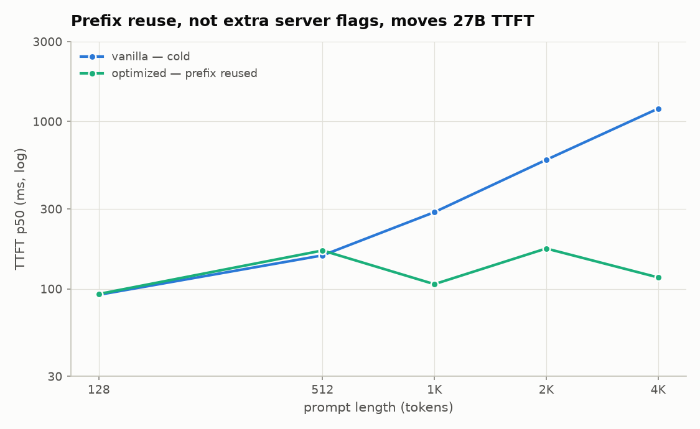
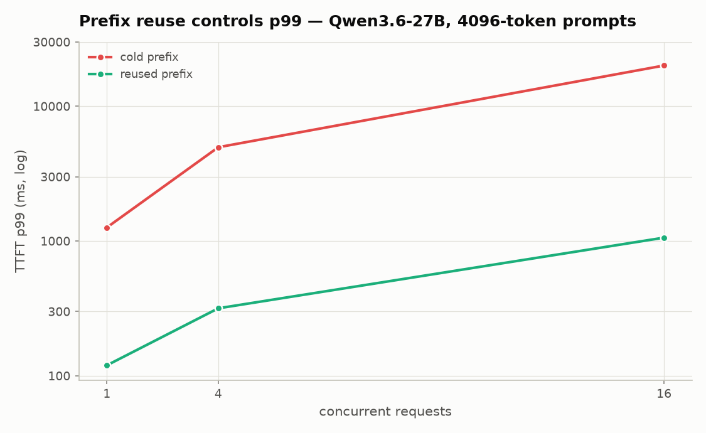

# ttft-trial — Qwen3.6-27B TTFT on one 48 GB Ada GPU

Measured answer to the assignment: run a Qwen 27B model locally, minimize client-observed time to first token (TTFT), and cross **TTFT < 1 s**.

## Result

**Target met.** `Qwen/Qwen3.6-27B-FP8` on one NVIDIA RTX 6000 Ada:

| workload | mode | p50 | p90 | p99 | samples |
|---|---|---:|---:|---:|---:|
| 3072-token cold prompt, c=1 | tuned | **839.7 ms** | 850.6 ms | 856.5 ms | 24 |
| 4096-token cold prompt, c=1 | vanilla | 1193.8 ms | 1197.4 ms | 1198.1 ms | 24 |
| 4096-token cold prompt, c=1 | tuned + optimized | **1063.2 ms** | 1080.6 ms | 1085.3 ms | 24 |
| 4096-token warm prompt, c=1 | optimized prefix cache | **117.1 ms** | 118.8 ms | 119.7 ms | 23 |

The claim is deliberately scoped: the measured sub-second boundary is 3072 cold tokens at concurrency 1. The best measured 4096-token cold p50 is 1.063 s, not sub-second. At 4096 tokens, a reusable prefix changes the result from 1.193 s to 117 ms, a **10.19×** p50 speedup.





Raw Tier C rows: [`results_tier_c/`](results_tier_c/). Full interpretation: [`REPORT.md`](REPORT.md). Exact continuation runbook: [`EXECUTION.md`](EXECUTION.md).

## Hardware and software

Tier C was measured on:

- NVIDIA RTX 6000 Ada Generation, 49,140 MiB, SM 8.9
- driver 570.195.03; CUDA toolkit/runtime 12.8 for this pod
- Python 3.12.3
- vLLM 0.19.1; torch 2.10.0+cu128
- `Qwen/Qwen3.6-27B-FP8`, text-only serving

Tier A/B data in [`results/`](results/) came from the earlier RTX 4000 Ada 20 GB session and must not be mixed into same-hardware engine speedups.

## What was measured

Client-observed TTFT is the interval from sending the HTTP request to receiving the first streamed token from `/v1/completions`.

- Exact tokenizer-length prompts: 128, 512, 1024, 2048, and 4096 tokens.
- Concurrency: 1, 4, and 16.
- Cache modes:
  - `cold`: a unique nonce is placed at the beginning, forcing a prefix-cache miss;
  - `warm`: requests share the long prefix and place a unique nonce at the end.
- Temperature 0; 16 generated tokens; warmups discarded; normally 24 measured requests per cell.
- The harness rejects a cell below the configured success fraction instead of writing partial data silently.

The one-cell 3072-token boundary run is in `results_tier_c/qwen36-27b-sub1.csv`. The full vanilla, tuned, optimized, and aggressive matrices are separate CSVs in the same directory.

## Tier C mode definitions

[`scripts/06_qwen36_27b.sh`](scripts/06_qwen36_27b.sh) contains the authoritative flags.

| mode | purpose | measured conclusion |
|---|---|---|
| `vanilla` | Minimum survival flags: text-only model, 8192 context, CUDA-graph capture capped at 256 | Stable baseline; 4096 cold p50 1193.8 ms |
| `tuned` | Vanilla scheduling plus five RTX 6000 Ada block-FP8 GEMM configs generated by `bench/tune_qwen36_fp8.py` | Mostly neutral over the full matrix; establishes 3072 cold p50 839.7 ms |
| `optimized` | 8192-token chunk budget, 0.92 GPU utilization, prefix caching | Cold c=1 is slightly worse alone; warm 4096 c=1 is 10.19× faster |
| `aggressive` | Optimized plus FP8 KV cache and `-O3` | Not a general win; multiple cold/concurrent cells regress |
| `cache-all` | Optional hybrid-Mamba cache experiment | Implemented but not part of the completed measured matrix |

Precomputed device-specific FP8 configurations are preserved in `results_tier_c/fp8_configs/`. They target the five Qwen3.6 matrix shapes at `M=4096`; they are not portable performance claims for other GPUs.

## Main findings

1. **Sub-second TTFT is real at 3072 cold tokens.** The p99 is also below 1 s (856.5 ms), so the headline is not a median-only artifact.
2. **4096 cold tokens remain just above the target.** Vanilla is 1193.8 ms; tuned plus optimized reaches 1063.2 ms (1.12×).
3. **Prefix caching dominates when the prefix is actually reusable.** Optimized 4096-token warm c=1 is 117.1 ms versus vanilla cold 1193.8 ms.
4. **Concurrency changes the problem from kernel latency to queueing.** Vanilla 4096 cold p50 rises from 1.194 s at c=1 to 2.421 s at c=4 and 10.357 s at c=16; p99 reaches 19.963 s at c=16.
5. **The progressive 27B prefix sweep did not produce monotonic cache hits.** Its fitted slope is negative and not physically meaningful. Preserve the raw file as a failed experiment; do not quote its regression as a performance model. The exact shared-prefix workload above is the valid cache result.
6. **Tier A/B remain useful supporting evidence.** On Qwen3-4B, FP8 was the only server-level change with a broad cold-path win; the hybrid Qwen3.5-4B architecture scaled flatter than full attention and was 1.31× faster at 16k tokens.

## TGI status

There is **no valid TGI TTFT number in this repository**. Do not fill one in from failed attempts.

- TGI does not support the hybrid Qwen3.6-27B architecture, so it cannot be the 27B engine baseline.
- A fair TGI comparison must use the classic `Qwen/Qwen3-4B-Instruct-2507` model.
- This pod had no Docker daemon. A source-built TGI 3.3.7 stack loaded the 4B checkpoint, but its embedded Python tokenizer worker failed and every POST connection closed; no CSV was accepted.
- The reliable continuation is a fresh RunPod using the official TGI container, then run the harness with `--api chat`. See `scripts/01_tgi.sh` and `EXECUTION.md`.

## Reproduce

Fresh RTX 6000 Ada/L40S pod:

```bash
bash scripts/00_setup.sh tier-c
python bench/tune_qwen36_fp8.py --install
bash run_tier_c.sh vanilla tuned optimized aggressive
```

For only the assigned cold headline, run `vanilla`, install/reuse the FP8 configs, then run `tuned`. `run_tier_c.sh` bounds startup, kills the real vLLM child process, records server logs/environment data, keeps 27B data separate, and regenerates Tier C plots.

Focused harness tests:

```bash
python -m unittest tests.test_ttft_harness
```

## Repository map

- `bench/benchmark_ttft.py` — exact-token asynchronous TTFT harness
- `bench/prefix_cache_sweep.py` — cache sweep; rejects non-physical fits
- `bench/tune_qwen36_fp8.py` — bounded RTX 6000 Ada block-FP8 kernel tuner
- `bench/analyze.py` — summary, speedup tables, and plots
- `scripts/06_qwen36_27b.sh` — Tier C server modes
- `run_tier_c.sh` — end-to-end Tier C orchestration
- `results_tier_c/` — raw 27B CSVs, server logs, environment, kernel configs
- `plots_tier_c/` — final 27B figures
- `results/`, `plots/` — earlier 4B and architecture-study evidence
- `DEBUGLOG.md` — current, actionable failure ledger only
