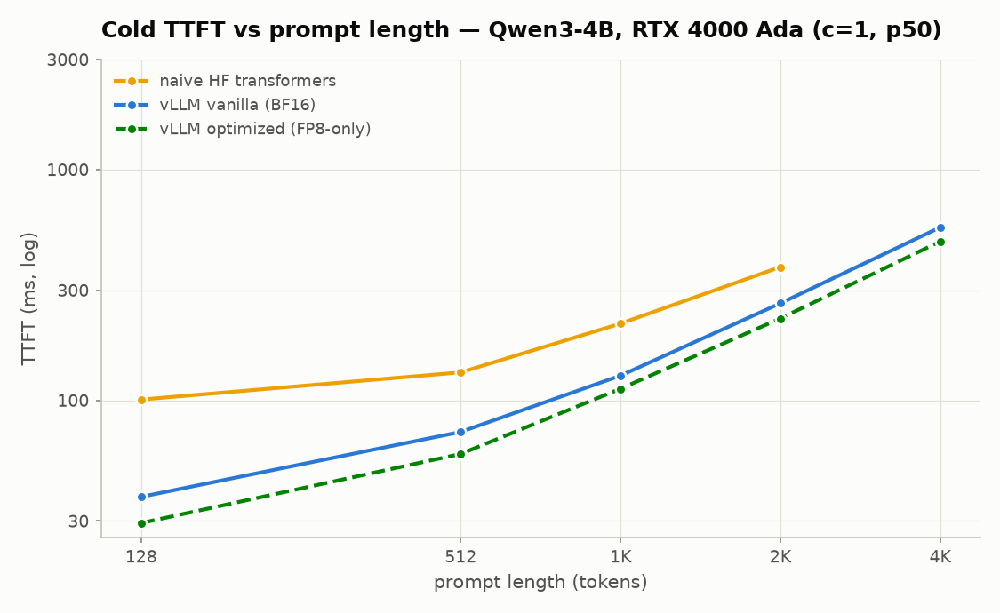
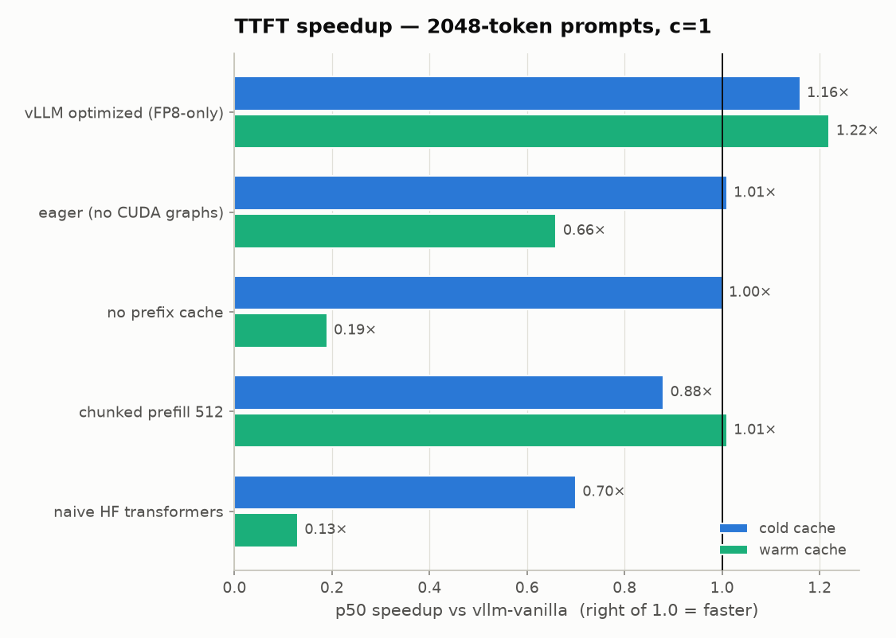
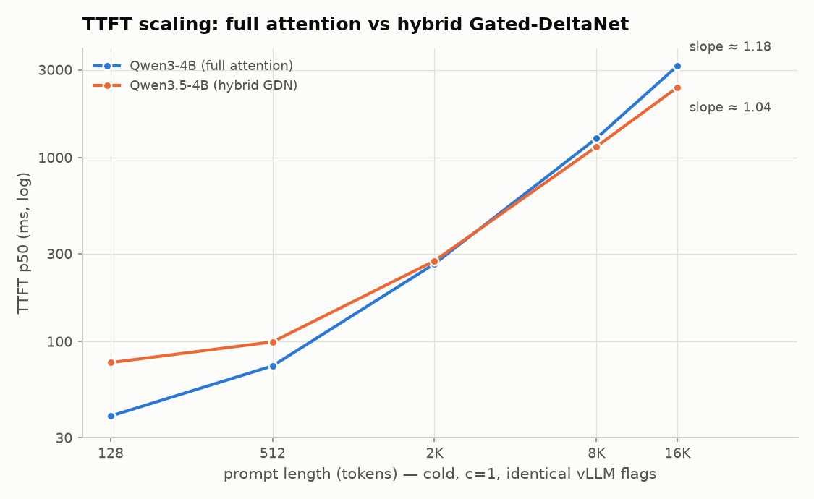

# Minimizing TTFT for Local LLM Serving — Results Report

**Author:** Alp · **Date:** 2026-07-07 (Tier A+B complete; Tier C pending) · **Repo:** this one

> **Status:** Phases 1–4 measured and final. Two slots remain open and are
> marked inline: **TODO(tgi)** (Phase 3, separate TGI pod) and **TODO(tier-c)**
> (Phase 5, Qwen3.6-27B-FP8 on a 48 GB pod — the headline task).

## 1. Setup
- GPU: NVIDIA RTX 4000 Ada, 20 GB, SM 8.9 (FP8 + FlashAttention-2 capable) — RunPod
- Model: Qwen3-4B-Instruct-2507 (BF16) and its official FP8 checkpoint
- Software: vLLM 0.19.1, torch 2.10.0+cu128, CUDA 12.4, driver 550.127.05,
  TGI **TODO(tgi)**
- Why not the 27B on this card: even the FP8 checkpoint is ~27 GB of weights;
  the 27B runs in Tier C on a 48 GB Ada pod (§7). Qwen3.6-27B is also a hybrid
  Gated-DeltaNet architecture that TGI does not support, so the 3-engine
  vanilla comparison uses the classic-architecture 4B all engines can serve.

## 2. Methodology
Client-observed TTFT = request-send → first streamed token, via the raw
`/v1/completions` endpoint (bypasses chat templates and Qwen's `<think>`
blocks). Exact-length prompts built with the model tokenizer; cold (unique
prefix per request → guaranteed cache miss) vs warm (shared prefix) cache
modes; temperature=0, max_tokens=16; warmup requests discarded; target N=24
for vLLM cells (tables show actual `n`; naive HF was N=12); p50/p90/p99
reported. The harness now fails future runs below the success threshold before
writing CSV. Full harness in `bench/`, raw CSVs in `results/`, every number
regenerable via `bench/analyze.py`.

## 3. Headline result (Tier A, 4B)
> TTFT at 2048-token prompts, concurrency=1:
> naive HF **378 ms** → TGI vanilla **TODO(tgi) ms** → vLLM vanilla **263 ms** →
> vLLM optimized (FP8-only) cold **226 ms** / warm-cache **40 ms**
> = **1.7×** over naive HF cold, **1.16×** over vanilla vLLM cold, and
> **6.5×** over vanilla-cold when the prefix is cached — caching, not flags,
> is the big lever at c=1.

> **TODO(tier-c) — the assigned headline:** Qwen3.6-27B-FP8, 4096-token cold
> prompt, c=1: target p50 TTFT **< 1000 ms** (vanilla vs optimized, plus warm).

## 4. Full results table
See [results/summary.md](results/summary.md) (absolute p50/p90/p99) and
[results/speedup.md](results/speedup.md) (per-cell speedup vs vLLM vanilla).

## 5. Ablation — where the speed comes from (and doesn't)
Baseline for every Δ: `vllm-vanilla` (BF16, stock defaults, max-model-len 16384).

| mechanism toggled | Δ TTFT cold | Δ TTFT warm | Δ p99 @ c=16 | why |
|---|---|---|---|---|
| prefix caching OFF | ~0 (1.0×) | **0.07–0.33×** (4096/c1: 563 vs 65 ms) | — | the warm path re-prefills everything; caching is the single biggest lever |
| CUDA graphs OFF (eager) | 0.63× at 128 tok/c1 (+22 ms) | 0.58–0.74× everywhere | ~flat | per-step CPU launch overhead is a fixed slice — visible exactly where TTFT is small |
| chunked-prefill budget 8192→512 | **0.39×** at 2048/c16 | ~flat | *worse* (4.9 s vs 4.3 s) | small chunks serialize long prefills; the theoretical HoL-blocking win never appears because our load is homogeneous — every request is long, there are no short victims to protect |
| BF16 → FP8 checkpoint (fp8-only) | **1.15–1.6×** across the matrix | 1.2–1.5× | 1.1–1.6× | prefill is compute-bound; Ada FP8 tensor cores double matmul throughput |

**The honest optimized config is small.** `vllm-fp8-only` (FP8 checkpoint plus
minimal context cap) is now the primary Tier-A optimized datapoint and matches
`scripts/03_vllm_optimized.sh`. The old 5-flag `vllm-optimized` bundle is
archived under `results/legacy/vllm-optimized-5flag.csv`; it regressed several
cold-concurrency cells (`-O3`: 512 tok/c16 was 828 ms vs 428 ms for FP8-only).
FP8 carries essentially the whole flag-level win, and this verdict drives the
conservative Tier-C config in `scripts/06_qwen36_27b.sh`.

## 6. Novel findings
1. **Analytical TTFT model.** Fitted `TTFT = a + b·uncached_tokens` on the
   prefix-cache sweep (FP8 4B, 4096-token prompts, 0→95% cached):
   a = **51.5 ms** fixed overhead, effective prefill throughput =
   **9,188 tok/s** (b = 108.8 µs/token), **R² = 0.9987**; holdout at 60%
   cached predicted 229.9 ms vs measured 237.9 ms = **3.4% error**.
   Practical rule derived: *put static content (system prompt, docs) first,
   volatile content last* — quantified warm-path win at 95% cached: **7.1×**
   (492 → 70 ms).
2. **Architecture scaling: hybrid Gated-DeltaNet vs full attention**
   (Qwen3.5-4B vs Qwen3-4B, identical vLLM flags, cold, c=1, 128→16k):
   the hybrid pays a higher fixed cost at short prompts (77 vs 39 ms at 128
   tok) but scales flatter — it is still slightly slower at 2048 tokens
   (275 vs 265 ms), crosses between 2k and 8k, and is **1.31× faster at 16k**
   (2408 vs 3149 ms). This is the mechanism that should keep long-context TTFT
   tractable on Qwen3.6-27B.
   
3. **FP8 is the only flag that pays at this scale.** Weight-level compute
   quantization (FP8, 1.15–1.6× cold) dwarfs every scheduler/compile knob we
   ablated; see §5. (INT4-AWQ prefill comparison was descoped: weight-only
   quant targets the bandwidth-bound decode path, not compute-bound prefill.)

## 7. Tier C — the assigned task (pending)
**TODO(tier-c):** Qwen3.6-27B-FP8 on a 48 GB Ada pod (L40S / RTX 6000 Ada,
~$3–5 for the session), `scripts/06_qwen36_27b.sh` vanilla → optimized →
aggressive, plus the 27B prefix sweep.

**Pre-registered expectation (honest risk):** scaling the fitted 4B-FP8
prefill throughput (9.2k tok/s on this 20 GB card) by ~6.75× model FLOPs and
~3× card FP8 throughput lands 4096-token cold TTFT **near ~1.0 s — at the
target, not comfortably under it**. Levers if it misses: the hybrid GDN
prefill discount (finding #2), one-step chunk budget (8192 ≥ prompt), and
reporting the warm number alongside (the fitted model predicts <100 ms warm
at 95% cached).

## 8. What I'd do next
- TensorRT-LLM engine build for the last ~20–30% of prefill compute.
- Disaggregated prefill/decode (vLLM P/D, Mooncake-style) for p99 under load.
- A mixed-length workload to measure the chunked-prefill HoL tradeoff that a
  homogeneous benchmark structurally cannot show (§5).
